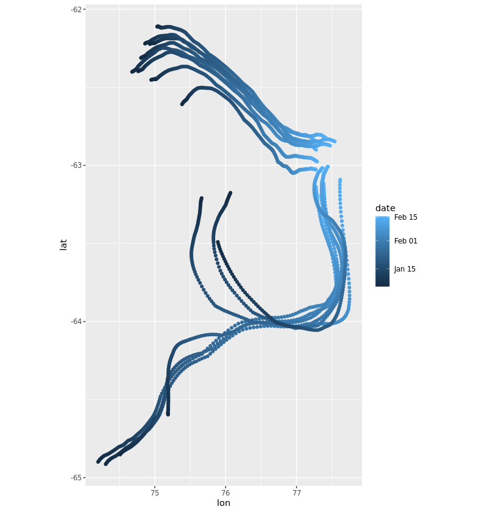

<!-- README.md is generated from README.Rmd. Please edit that file -->

```{r, include = FALSE}
knitr::opts_chunk$set(
  collapse = TRUE,
  comment = "#>",
  fig.path = "man/figures/README-",
  out.width = "100%"
)
```

# currently

<!-- badges: start -->
<!-- badges: end -->

The goal of currently is to particle trace. 

## Installation

And the development version from [GitHub](https://github.com/) with:

``` r
# install.packages("devtools")
devtools::install_github("mdsumner/currently")
```
## Example

This is a basic example which shows you how to solve a common problem:

```R
library(raadtools)  ## assuming version >= 0.6.0.9005

library(currently) 


pt0 <- cbind( 77 +  28.45/60, -63)
nn <- 15
pts <- cbind(jitter(rep(pt0[1], nn), factor = 0.15),
             jitter(rep(pt0[2], nn), factor = 0.15))


sdate <- as.POSIXct(as.Date("2021-02-15"))
duration <- 6 * 7 * 24 * 3600
#duration <- 2 * 24 * 3600

d <- particle_trace(pts, time_step = 6 * 3600, start_date = sdate, end_date = sdate + duration)
dl <- particle_trace_ll(pts, time_step = 6 * 3600, start_date = sdate, end_date = sdate + duration)
library(ggplot2)
ggplot() + #geom_raster(data = ddt, aes(x, y, fill = z))
  geom_point(data = d, aes(lon, lat, col = date, fill = NULL)) + coord_fixed(2.2)

library(ggplot2)
ggplot() + #geom_raster(data = ddt, aes(x, y, fill = z))
  geom_point(data = dl, aes(x, y, col = date, fill = NULL)) + coord_fixed(2.2)


```


